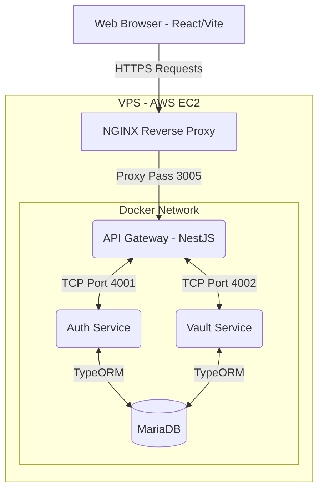
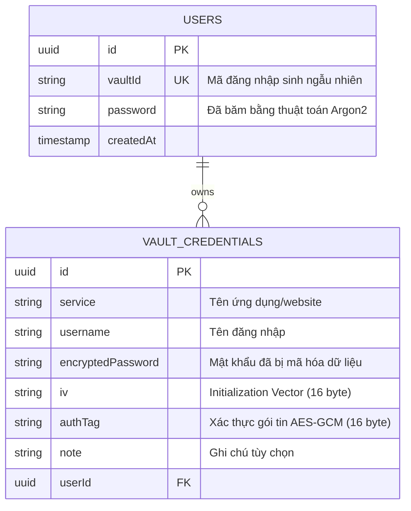
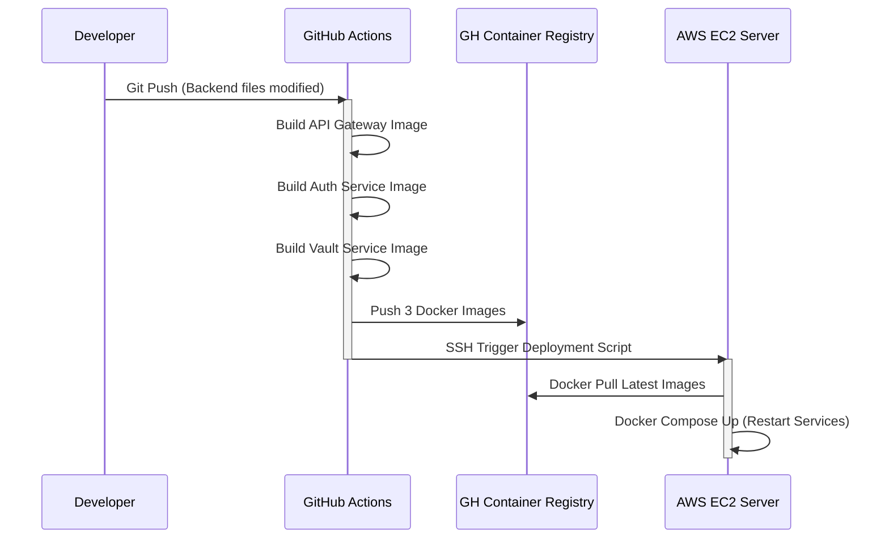

# Kiến trúc hệ thống: Secure Vault

Tài liệu này mô tả chi tiết kiến trúc của nền tảng **Secure Vault**, bao gồm thiết kế Microservices, sơ đồ luồng dữ liệu, và phương pháp mã hóa bảo mật.

---

## 1. Sơ đồ Kiến trúc Tổng thể (High-level Architecture)

Hệ thống được thiết kế theo mô hình Client-Server với Backend phân mảnh (Microservices Architecture) nhằm tách bạch rõ ràng Domain Logic.

### Chức năng của từng thành phần:
- **Client (Frontend)**: Giao diện người dùng SPA host trên `Vercel`. Giao tiếp với API qua phương thức REST/JSON kèm JWT token.
- **NGINX**: Tiếp nhận Request từ ngoài Internet, cấp phát chứng chỉ HTTPS Let's Encrypt và xử lý CORS preflight.
- **API Gateway**: Đầu mối RESTful API duy nhất. Chịu trách nhiệm Validate JWT Guards và Forward dữ liệu đến các dịch vụ vi mô qua chuẩn giao tiếp TCP nội bộ.
- **Auth Service**: Đứng độc lập quản lý logic định danh. Phát sinh `Vault ID` duy nhất, mã hóa nén mật khẩu người dùng và xác thực JWT.
- **Vault Service**: Đứng độc lập xử lý logic nghiệp vụ. Chứa Engine giải mã và mã hóa đối xứng (AES) cho từng Credential riêng lẻ của người dùng trước khi ghi vào Database.

---

## 2. Thiết kế Database Schema

Hệ thống sử dụng hệ quản trị CSDL quan hệ MariaDB với thiết kế khóa ngoại (Foreign Key) chặt chẽ:

---

## 3. Kiến trúc Bảo mật / Mã hóa (Security Flow)

Secure Vault áp dụng tiêu chuẩn bảo mật ngân hàng để đảm bảo **Không một ai (Kể cả Database Admin) có thể đọc được mật khẩu gốc của người dùng**.

1. **Bảo mật danh tính (Auth/Argon2)**
   - Không lưu trữ `Email` hay thông tin cá nhân.
   - Khi người dùng đăng ký, hệ thống băm mật khẩu bằng **Argon2** (Thuật toán kháng Brute-force mạnh nhất hiện nay) cùng với một muối (Salt) động.
   
2. **Mã hóa Dữ liệu Nhạy cảm (Vault/AES-256-GCM)**
   - Mọi mật khẩu người dùng lưu vào kho (Credential Password) đều bị mã hóa 2 chiều ngay khi chạm tới `Vault Service` bằng thuật toán **AES-256-GCM**.
   - **GCM (Galois/Counter Mode)**: Ngoài mã hóa, thuật toán này còn sinh ra một `authTag`. Lúc giải mã, nếu dữ liệu bị tin tặc chỉnh sửa trái phép dù chỉ 1 byte, `authTag` sẽ không khớp và quá trình giải mã lập tức báo lỗi.
   - **IV rải rác**: Mỗi một password được lưu sẽ sinh ra một Initialization Vector (IV) ngẫu nhiên, giúp cùng một mật khẩu nhưng mã hóa ra các chuỗi hoàn toàn khác nhau.

---

## 4. Kiến trúc Triển khai (CI/CD Pipeline)

Để đảm bảo hiệu suất vận hành cao trên cấu hình VPS giới hạn, mô hình Deployment được ứng dụng để dời tác vụ nặng đứt gãy lên Server trung gian (GitHub Actions).

